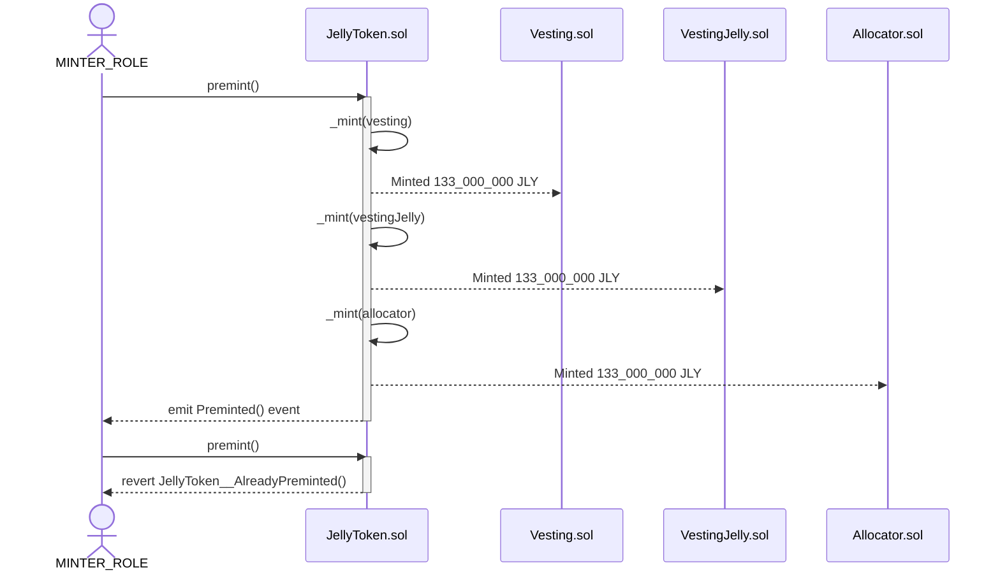
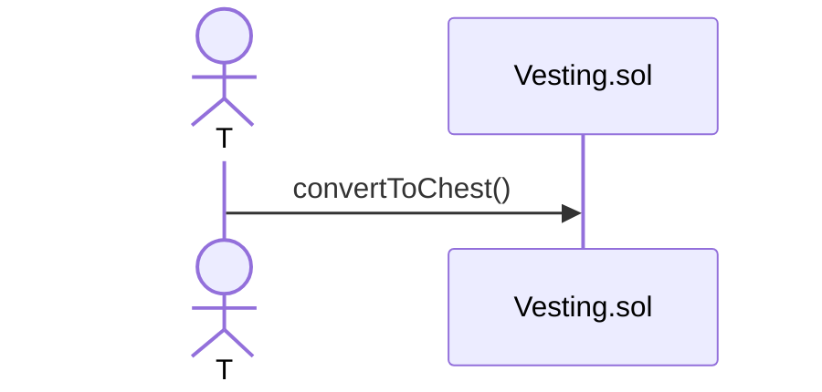
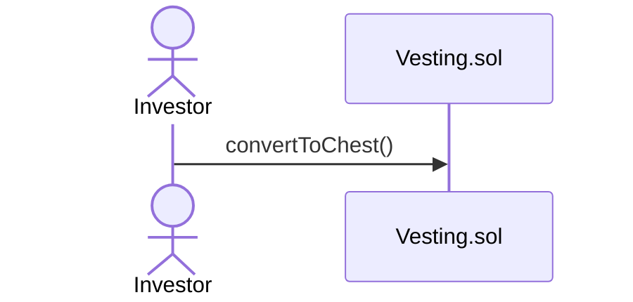

# Jelly Verse contracts

## Getting Started

This project combines Hardhat and Foundry.

### Prerequisites

Be sure to have installed the following

- [Git](https://git-scm.com/book/en/v2/Getting-Started-Installing-Git)
- [Current LTS Node.js version](https://nodejs.org/en/about/releases/)

### Build & Compile

1. Clone the repo

```shell
git clone git@github.com:MVPWorkshop/jelly-verse-contracts.git && cd jelly-verse-contracts
```

2. Install packages

```shell
npm install
```

3. Install [Foundry](https://book.getfoundry.sh/getting-started/installation)

```shell
curl -L https://foundry.paradigm.xyz | bash
foundryup
```

4. Compile contracts

```shell
npx hardhat compile
```

[Optionally]

```shell
forge build
```

5. Run tests

```shell
npx hardhat test
```

6. Run invariant tests

```shell
forge test
```

## Usage

This project consists of the following smart contracts:

- [JellyToken](./contracts/JellyToken.sol)
- [Vesting](./contracts/Vesting.sol)
- [VestingJelly](./contracts/VestingJelly.sol)
- [Allocator](./contracts/Allocator.sol)
- [Chest](./contracts/Chest.sol)

This is the UML dependency graph between these contracts:


### Sequence Diagrams

This is the overview of the functionalities of this project:

#### Pre-minting of tokens



#### Community members can buy JLY tokens with DUSD and DFI

Buying JLY tokens with DFI locks tokens into the Chest NFT smart contract with a linear vesting schedule. Chest NFTs are non-transferable and give voting power to the holder.

Buying JLY tokens with DUSD adds tokens to the JellyVerse DEX pool and gives JLY tokens back to the User instantly. There is no vesting schedule, but also no voting power through the Chest NFT.



#### Tokens for Team Members and Investors

Tokens for Team members and Investors are linearly vested through Vesting and VestingJelly smart contract.

```
/**
 *  token amount
 *       ^
 *       |                           __________________
 *       |                          /
 *       |                         /
 *       |                        /
 *       |                       /
 *       |                      /
 *       | <----- cliff ----->
 *       |
 *       |
 *        --------------------.------.-------------------> time
 *                         vesting duration
 */
```

Team members and Investors can convert the portion or the whole amount of their vested tokens into Chest NFTs to gain voting power.



### JellyToken

This is an overview of the JellyToken storage variables:

This is an overview of the JellyToken functions:

// ovo sa forge doc, napisi ako ima external poziva
